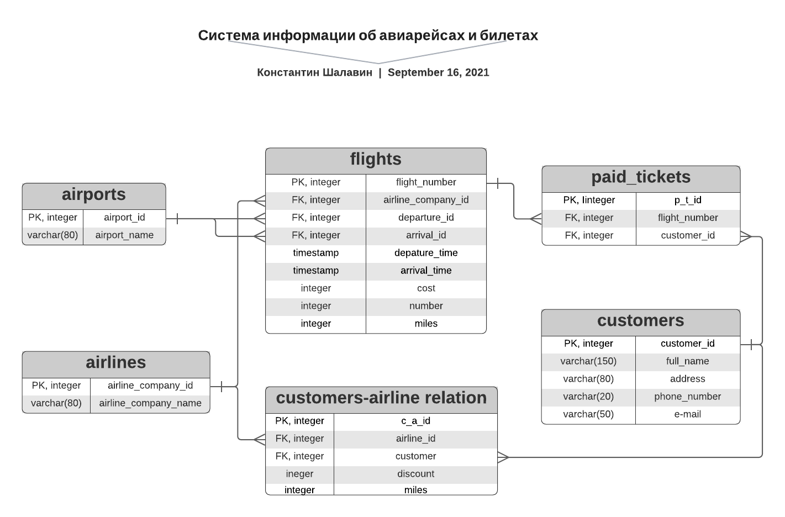

# JavaPrac

## Maven commands
```
mvn spring-boot:run - запуск приложения

mvn sql:execute@create-db
mvn sql:execute@drop-db
mvn sql:execute@init-db
mvn sql:execute@fill-db
mvn sql:execute@drop-tables

mvn test
```
## Main page


## DB scheme



## Description

Read description.pdf
